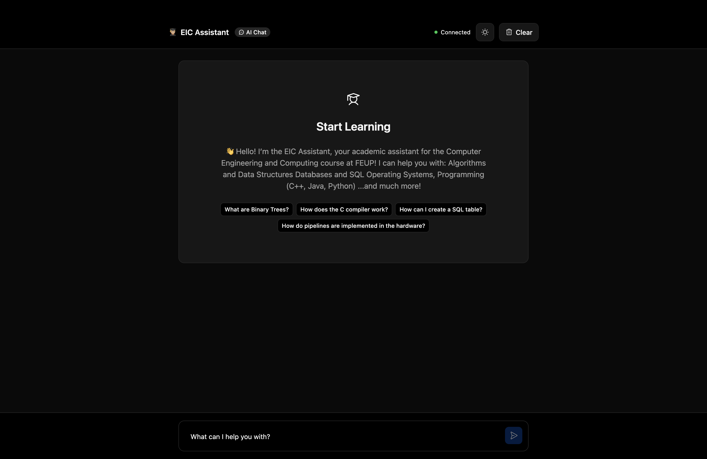
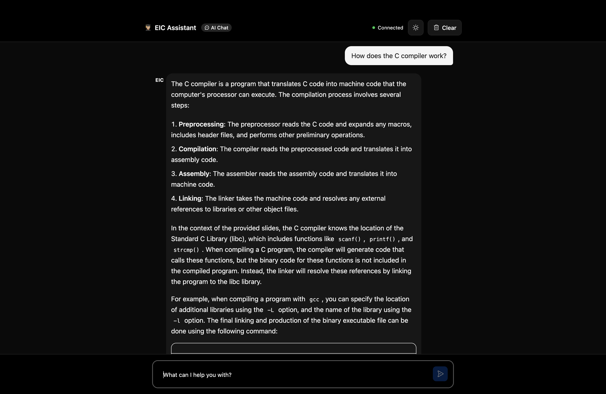

# EIC Assistant 🎓

An AI-powered academic assistant for Computer Engineering and Computing (EIC)
students at the University of Porto (FEUP), built on Cloudflare's edge infrastructure.

> **Live Demo:** https://eic-assistant.goncalo-luis-pinto.workers.dev

---

## Screenshots




---

## Overview

EIC Assistant uses Retrieval-Augmented Generation (RAG) to answer questions
based on real FEUP course slides, rather than relying solely on general AI knowledge.
It covers topics such as Algorithms and Data Structures, Databases, SQL,
Operating Systems, Computer architecture and Programming.

---

## Architecture

```
User (Browser)
    ↓ WebSocket
AIChatAgent (Durable Objects)
    ↓ embed query
Workers AI (bge-base-en-v1.5)
    ↓ semantic search
Vectorize (eic-embeddings)
    ↓ inject context
Workers AI (Llama 3.3 70B)
    ↓ stream response
User (Browser)
```

### Components

| Component  | Technology                    | Purpose                            |
| ---------- | ----------------------------- | ---------------------------------- |
| Chat UI    | React + Cloudflare Kumo       | Frontend interface                 |
| Agent      | AIChatAgent + Durable Objects | Chat logic + message persistence   |
| LLM        | Llama 3.3 70B (Workers AI)    | Response generation                |
| Embeddings | bge-base-en-v1.5 (Workers AI) | Semantic vector generation         |
| Vector DB  | Cloudflare Vectorize          | Semantic search over course slides |

---

## Requirements Coverage

| Requirement             | Implementation                                   |
| ----------------------- | ------------------------------------------------ |
| LLM                     | Llama 3.3 70B via Workers AI                     |
| Workflow / coordination | AIChatAgent + Durable Objects                    |
| User input via chat     | WebSocket chat interface                         |
| Memory or state         | Durable Objects (chat history) + Vectorize (RAG) |

---

## Running Locally

### Prerequisites

- Node.js 18+
- Cloudflare account
- Wrangler CLI

### Setup

```bash
# Clone the repository
git clone https://github.com/goncalopinto1/cf_ai_eic-assistant
cd cf_ai_eic-assistant

# Install dependencies
npm install

# Create .env file
cp .env.example .env
# Fill in your CLOUDFLARE_ACCOUNT_ID and CLOUDFLARE_API_TOKEN
```

### Index your course slides

```bash
# Add your PDF files to the pdfs/ folder
# Then run the ingestion script
npx tsx src/ingest.ts
```

### Run locally

```bash
npm run dev
```

Open http://localhost:5173 in your browser.

---

## Deployment

```bash
npm run deploy
```

---

## Project Structure

```
eic-assistant/
├── src/
│   ├── server.ts        # AIChatAgent — RAG logic + LLM
│   ├── ingest.ts        # PDF ingestion pipeline
│   ├── app.tsx          # React chat interface
│   └── client.tsx       # React entry point
├── pdfs/                # Course slides (not committed)
│   ├── ac/
│   └── aed/
│   └── bd/
│   └── so/
├── public/              # Static assets
├── PROMPTS.md           # Prompt engineering documentation
└── wrangler.jsonc       # Cloudflare configuration
```

---

## Tech Stack

- [Cloudflare Workers](https://developers.cloudflare.com/workers/)
- [Cloudflare Durable Objects](https://developers.cloudflare.com/durable-objects/)
- [Cloudflare Workers AI](https://developers.cloudflare.com/workers-ai/)
- [Cloudflare Vectorize](https://developers.cloudflare.com/vectorize/)
- [Cloudflare Agents SDK](https://developers.cloudflare.com/agents/)
- [React 19](https://react.dev/)

---

## AI Assistance

This project was built with assistance from Claude (Anthropic) as a development
partner. All AI prompts used during development are documented in [PROMPTS.md](PROMPTS.md).
